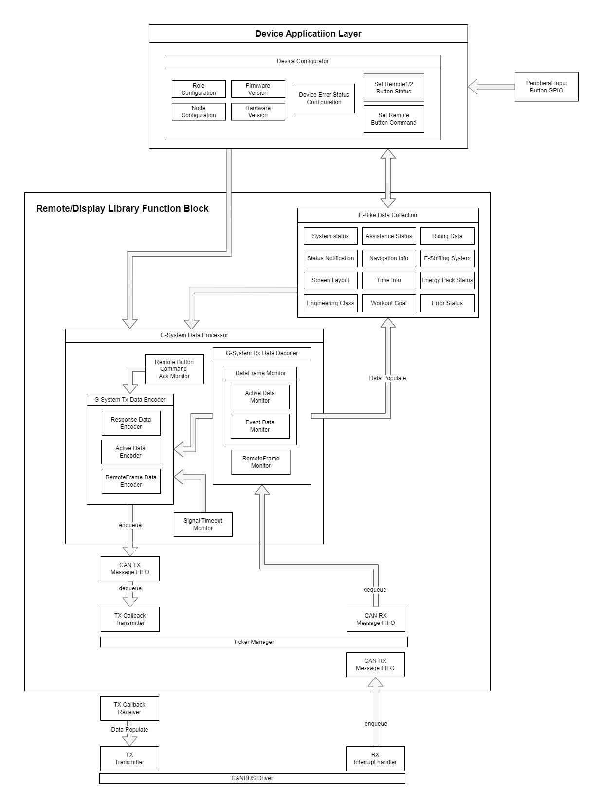

| 版本 |  釋出時間  | 修改紀錄 |
| :--: | :--------: | -------- |
| 初版 | 2023/09/21 |          |
| V1.1 | 2023/09/21 | 進版測試 |


[TOC]

# gsys_remote_display_lib使用說明


```c
// TBD
```


# 功能方塊圖




# CMakeList.txt說明

若使用CMake的方式引入此Library，請在您的專案根目錄CMakeList.txt加入以下代碼。

```cmake
# ======================== GSYS =======================================

# 定義一個名為 "gsys_append_library_" 的函數，用於將Library添加到GLOBAL屬性 "ITE_SDK_LIBS" 中。
function(gsys_append_library_ library)
    set_property(GLOBAL APPEND PROPERTY ITE_SDK_LIBS ${library})
endfunction()

# 定義一個名為 "gsys_add_library" 的Macro，用於添加Library、鏈接Library和調用 "gsys_append_library_" 函數。
macro(gsys_add_library library)
    # 添加一個Library，Library的名稱由傳入的參數 "library" 決定。
    add_library(${library})
    
    # 將Library鏈接到 "ite_sdk_interface" Library庫。
    target_link_libraries(${library} PUBLIC ite_sdk_interface)
    
    # 調用 "gsys_append_library_" 函數，將Library添加到GLOBAL屬性 "ITE_SDK_LIBS" 中。
    gsys_append_library_(${library})
endmacro()

# 添加項目Sorce code中所需的header file搜索路徑，以便編譯器能夠找到這些(.h)。
include_directories(${PROJECT_SOURCE_DIR}/gsys_remote_display_lib)
include_directories(${PROJECT_SOURCE_DIR}/gsys_remote_display_lib/gsys_inc)
include_directories(${PROJECT_SOURCE_DIR}/gsys_remote_display_lib/gsys_inc/gsys_data_structure)
include_directories(${PROJECT_SOURCE_DIR}/gsys_remote_display_lib/gsys_canbus)
include_directories(${PROJECT_SOURCE_DIR}/gsys_remote_display_lib/gsys_rx_data)
include_directories(${PROJECT_SOURCE_DIR}/gsys_remote_display_lib/gsys_tx_data)

# 添加子目錄 "gsys_remote_display_lib"，這個子目錄中包含了與項目相關的其他 CMakeLists.txt 文件。
add_subdirectory(${PROJECT_SOURCE_DIR}/gsys_remote_display_lib)

# ======================== GSYS =======================================
```

